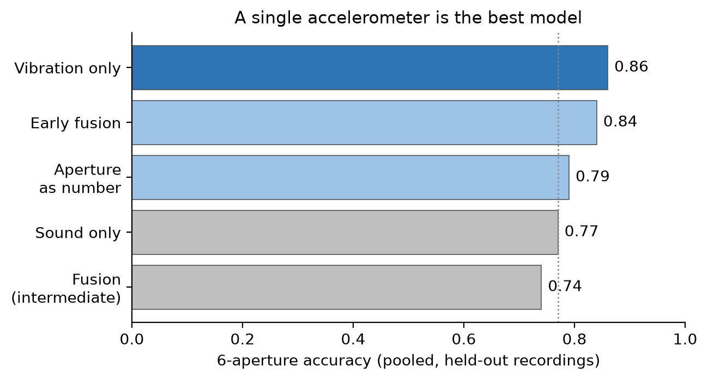
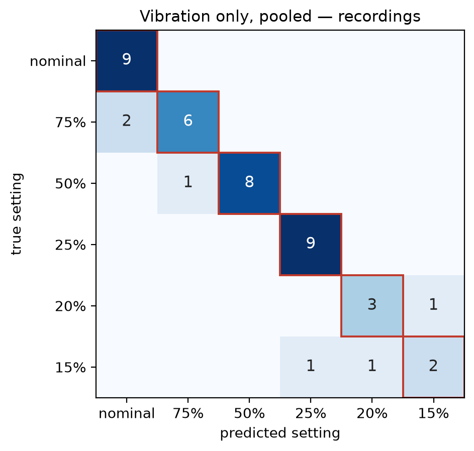

# Cavitation detection of a centrifugal pump from sound and/or vibration

**Sina Mohebbi**

Detecting cavitation in a centrifugal pump from its sound and vibration with a small neural
network. A microphone and an accelerometer record the pump while an inlet valve is closed
step by step, and the task is to recognise the setting from a short slice of the signals:
`nominal · 75% · 50% · 25% · 20% · 15%`. Cavitation is never fully developed for safety
reasons and begins around the 25% setting, so the six settings really cover three physical
states: no cavitation (nominal, 75%, 50%), onset (25%) and developing cavitation (20%, 15%).

## Main result

A **single accelerometer** turns out to be the best model here: 0.86 on the exact aperture,
above the microphone alone (0.77). Combining the two sensors does not improve on it, and no
time-frequency transform is needed. **Cavitation vs. no cavitation is detected perfectly
(100%)** on recordings the model has never seen, in both clean and noisy conditions.

The evaluation method matters more than the model: with shuffled windows every model scores
about 100%, because windows from the same recording land in both training and test.

---

## Data

| | |
|---|---|
| Recordings | 43 usable (23 clean, 20 noisy) |
| Length | mostly 180 s, some 100–300 s |
| Microphone | 2 channels, 48 kHz |
| Accelerometer | 3 axes, 4 kHz |
| Labels | one valve setting per recording |

Clean and noisy (second pump running) are treated as two separate datasets. One recording
(`20260401_133648`) was dropped because its accelerometer file is empty. The IMU and piezo
files are empty throughout and were not used.

Recordings per class:

| | nominal | 75% | 50% | 25% | 20% | 15% |
|---|:---:|:---:|:---:|:---:|:---:|:---:|
| Clean | 6 | 4 | 4 | 5 | 2 | 2 |
| Noisy | 3 | 4 | 5 | 4 | 2 | 2 |

The two most severe settings have only two recordings each per condition, which turns out to
be the main limit on performance.

The dataset itself (~11 GB) is not in this repository. Unzip it into `Dataset/` at the
project root; the label mapping is in `Dataset/README.txt`.

---

## Pipeline

**Step 1 — Preparation (`preprocess.py`).** The raw CSV files are read once and each
recording is stored compactly (accelerometer as float32, microphone as int16), with an index
listing every recording and its label.

**Step 2 — Windows and normalisation (`dataset.py`).** Each recording is cut into 1-second
windows (50% overlap in training, none in testing). Both sensors are used in full: all three
accelerometer axes and both microphone channels. Normalisation is per window and per channel:
the mean is subtracted (removing the DC component and the gravity offset on the
accelerometer); the microphone is divided by 32768 to bring it to roughly ±1, and the
accelerometer is kept in g. Amplitude is deliberately preserved (no unit-variance scaling),
because the vibration and sound level themselves change with the operating point and carry
information.

**Step 3 — Data augmentation (training only).** Each training window is perturbed on the fly:
a random time shift of up to ±10% of the window length, a random gain of ±8%, and additive
Gaussian noise at 2% of the window's standard deviation. The same shift and gain are applied
to both signals so they stay aligned. Test windows are never augmented.

**Step 4 — Time-frequency transform (spectrogram models only).** A short-time Fourier
transform (STFT), not a wavelet transform. The magnitude spectrogram is passed through
log(1 + x). Window and hop are 1024 / 512 for the microphone and 256 / 128 for the
accelerometer, with a Hann window. For early fusion each spectrogram is resized to a common
64×64 grid. The time-domain models skip this step.

**Training settings**, identical for every model: AdamW, learning rate 1e-3, weight decay
1e-4, cosine schedule, batch size 32, 20 epochs, class weighting, and a fixed random seed so
every run reproduces exactly.

---

## How the models were evaluated

Two protocols were used, and the difference between them turned out to be larger than the
difference between any two models.

**Shuffled windows.** All windows from all recordings are pooled, shuffled, and split
70/15/15 (the protocol in the reference MATLAB implementation, `randperm` over all
observations). Because windows from the same recording appear in both training and test, the
model is tested on data very similar to what it trained on.

**New recordings.** A whole recording is held out, the model trains on the rest, and this
repeats until every recording has been the test recording once. Training and test never share
a recording. For the larger pooled experiments, 4 folds of several recordings were used
instead of one at a time; whole recordings still stay together.

**Window overlap.** Training windows overlap by 50% while test windows do not, so the
correlation between neighbouring windows is higher in training. This is deliberate: overlap
gives the training set more examples, while non-overlapping test windows are more independent
and make the test stricter. Whole recordings are held out either way, so no test window shares
a recording with any training window.

**Metrics.** Recording-level accuracy: each recording's windows are classified, the majority
label is taken as its prediction, and accuracy is the fraction of recordings correct. Bracket
numbers give this fraction, e.g. 0.86 (37/43). Macro-F1 (unweighted average of per-class F1)
is also reported. For the regression variant the metrics are MAE, RMSE and R².

**Three views.** The six settings are also reported after merging them into three physical
states (none / onset / developing) and into two groups (cavitation vs. no cavitation). These
are not separate models and not one-class detection: the same six-class predictions are simply
grouped, so "cavitation vs. no cavitation" shows how many mistakes cross the boundary that
matters.

---

## Models tried

- **Sound only / vibration only** — single-branch 1-D CNN on the raw signal. Sound uses the
  two microphone channels; vibration uses the vertical accelerometer axis.
- **Fusion (intermediate)** — two parallel 1-D CNN branches, one per sensor, features
  concatenated then classified. Mirrors the reference implementation; works on the raw signal.
- **Gated fusion** — as above, with a gate that weights each modality.
- **Spectral fusion** — a spectrogram and 2-D CNN branch per sensor, then fused.
- **Hybrid** — raw branch, spectrogram branch, and hand-crafted descriptors (RMS, kurtosis,
  crest factor, spectral centroid, high-frequency ratio), combined.
- **Early fusion** — both signals become spectrograms, resized to 64×64 and stacked as the
  channels of a single 5-channel image; one CNN reads it, so the sensors are combined at the
  input. About 115k parameters. The strongest fusion approach, though a single accelerometer
  does as well.

The spectrogram models (spectral, hybrid, early fusion) use all three accelerometer axes; the
1-D models use the vertical axis only.


*Both signals become spectrograms, are stacked into one image, and are read by a single
network.*

---

## Results

### The recommended model on the separated setup

A single accelerometer (vibration only), clean and noisy kept separate. Accuracy and macro-F1
are for the 6-aperture task; the last two columns group the same predictions into 3 levels and
into cavitation vs. none:

| Condition | Accuracy | Macro-F1 | 3 levels | Cavitation vs. none |
|-----------|:---:|:---:|:---:|:---:|
| Clean | 0.74 (17/23) | 0.63 | 0.96 (22/23) | **1.00 (23/23)** |
| Noisy | 0.80 (16/20) | 0.70 | 0.95 (19/20) | **1.00 (20/20)** |

For comparison, the multimodal early-fusion model gives 0.70 (clean) and 0.80 (noisy), so on
the separated data too a single accelerometer is as good or better.

### All models on the same footing

Pooled recordings, 4 folds, identical training settings:

| Model | Sensors | Input | Accuracy | Macro-F1 | Cavitation |
|-------|---------|-------|:---:|:---:|:---:|
| **Vibration only** | accel (1 axis) | raw time domain | **0.86 (37/43)** | **0.82** | 1.00 |
| Early fusion | mic + accel (3 axes) | spectrograms | 0.84 (36/43) | 0.80 | 1.00 |
| Aperture as a number | mic + accel (3 axes) | spectrograms | 0.79 (34/43) | 0.78 | 1.00 |
| Sound only | mic (2 ch) | raw time domain | 0.77 (33/43) | 0.69 | 1.00 |
| Fusion (intermediate) | mic + accel (1 axis) | raw time domain | 0.74 (32/43) | 0.67 | 1.00 |



Vibration is the more informative sensor: the accelerometer alone (0.86) does markedly better
than the microphone alone (0.77). Combining the two does not improve on it — early fusion
(0.84) matches vibration-only within one recording, and intermediate fusion (0.74) is worse
than either sensor on its own. A single accelerometer, with no transform, is both the best and
the cheapest option. Cavitation is detected perfectly by every model, including each single
sensor.

### Is the time-frequency transform worth it?

| | Best model | Accuracy | Cavitation |
|---|---|:---:|:---:|
| Raw time domain (no transform) | vibration only | **0.86** | 1.00 |
| Spectrograms | early fusion | 0.84 | 1.00 |

The transform does not help: the best time-domain model (a single accelerometer) is as good
as the best spectrogram model and detects cavitation just as perfectly. The cheapest setup is
also the best.

### Shuffled windows, for comparison

Clean data: fusion 0.997, sound only 0.999, hybrid 1.000, early fusion 1.000. Every model
reaches essentially 100% — the same early-fusion model scores 1.00 here and 0.70 with held-out
recordings, showing the protocol matters more than the architecture.

### Predicting the aperture as a number

The same early fusion model and input, but a single continuous output trained with a smooth L1
loss (nominal counted as 100% open), evaluated pooled over 4 folds:

| Metric | Value |
|---|:---:|
| Mean absolute error (MAE) | **3.8 aperture points** |
| Root mean squared error (RMSE) | 6.6 aperture points |
| R² | **0.95** |

Snapping each prediction to the nearest setting gives 0.79 accuracy against 0.84 for the
classifier. 33 of 43 recordings land within 5 points of the true opening. It handles the 20%
setting better but underestimates the fully open recordings (predicting ~82–88 instead of
100), because predictions are pulled towards the middle of the range.

### Keeping clean and noisy separate

Using the vibration-only model:

| | Separate | Pooled |
|---|:---:|:---:|
| 6 apertures | 0.77 (33/43) | **0.86 (37/43)** |
| 3 levels | 0.95 | **0.98** |
| Cavitation | 1.00 | 1.00 |

Pooling helps mainly the two settings with few recordings: 20% and 15% improve from 3/8 to
5/8, because each then has 4 recordings instead of 2.

---

## Things that were tried and did not help

| Idea | Result |
|------|--------|
| Larger spectrograms (128×128) | 0.70 against 0.70 for 64×64. No gain, twice the compute. |
| Soft voting instead of majority | Identical result on every run. |
| AdamW and cosine schedule | No change to the result, kept as reasonable regularisation. |
| Gated fusion | No better than plain fusion. |
| Hand-crafted descriptors (hybrid) | 0.74, below early fusion. |

These show the limit is the amount of data, not the training recipe: several changes left the
result unchanged, while adding recordings (pooling) moved it by 10 points.

---

## Where the errors are



Every mistake is between neighbouring settings: **nominal and 75%** (neither has cavitation,
they differ only in flow rate) and **20% and 15%** (both developing, each with only 2
recordings). Every off-diagonal count sits right next to the diagonal. No recording with
cavitation was ever labelled as no cavitation, in any condition or any model — the mistakes
are always one step off, never a missed detection.

---

## Limitations

- **20% and 15% have 2 recordings each per condition.** Holding one out leaves a single
  example, and the two are at different microphone distances. Their individual results are
  unreliable; they are reliable when reported together as one level.
- **nominal and 75% are physically very close** — no cavitation at either, so some confusion
  is expected regardless of the model.
- **One session, one pump.** All recordings are from a single day, so the results say nothing
  about a different pump or installation.
- **The exact numbers are strict** — from testing on unseen recordings. The same models reach
  100% when windows are shuffled.

---

## Conclusions

1. **Cavitation detection is reliable on this data** — every model, including a single
   accelerometer, separates cavitation from no cavitation perfectly on unseen recordings, in
   both conditions.
2. **Vibration is the more informative sensor** — the accelerometer alone reaches 0.86, well
   above the microphone alone (0.77).
3. **Combining the sensors does not help** — early fusion (0.84) matches but does not beat
   vibration-only, and intermediate fusion (0.74) is worse than either sensor.
4. **The time-frequency transform is not needed** — a single accelerometer in the time domain
   is the best model and the cheapest.
5. **The evaluation protocol dominates the result** — 1.00 with shuffled windows, 0.70–0.86
   with held-out recordings.
6. **The remaining errors are physical or data-related**, not modelling failures.

## Possible next steps

- More recordings of 20% and 15% — the only change likely to lift the exact-aperture result.
- Reporting the aperture as a continuous value (error of about 4 points).
- Deploying a single accelerometer read in the time domain — the best model here, no transform
  needed, suited to a low-end device.
- Two-stage classification and self-supervised pretraining, if more data becomes available.

---

## Running the code

```bash
# once: turn the raw CSV files into compact arrays
python src/preprocess.py

# honest evaluation (hold out one whole recording at a time)
python src/cross_validate.py --mode accel --condition clean
python src/cross_validate.py --mode accel --condition noisy

# pool clean + noisy together, 4 folds
python src/cross_validate.py --mode accel --condition all --folds 4

# leaky reference (shuffle all windows, then split)
python src/shuffled_window.py --mode accel --condition clean

# predict the aperture as a number
python src/regression.py --mode earlyfusion --condition all --folds 4
```

Models: `accel` (vibration only, the best here), `mic` (sound only), `earlyfusion`, `hybrid`,
`spectral`, `fusion`, `gated`.

| File | What it does |
|------|--------------|
| `src/preprocess.py` | Reads the raw CSV files once and saves each recording compactly, plus an index with the labels. |
| `src/dataset.py` | Loads recordings and cuts them into 1-second windows of sound and vibration. |
| `src/model.py` | All the models: single-sensor networks, fusion variants, and early fusion. |
| `src/cross_validate.py` | The honest evaluation: hold out recordings, train on the rest, repeat. |
| `src/shuffled_window.py` | The leaky reference: pool all windows, shuffle, split. |
| `src/regression.py` | Predicts the aperture as a number instead of a class. |
| `src/train.py` | Trains on a single split. Used early on. |
| `src/split.py` | Builds a train/val/test split and cross-validation folds by recording. |
| `results/` | Raw output of every run, and the model diagram. |

### Setup

```bash
python -m venv .venv
.venv\Scripts\Activate.ps1          # Windows
pip install torch --index-url https://download.pytorch.org/whl/cu124
pip install -r requirements.txt
```

Training runs on the GPU if one is available. Results are reproducible: the random seed is
fixed, so repeating a run gives the same numbers.
