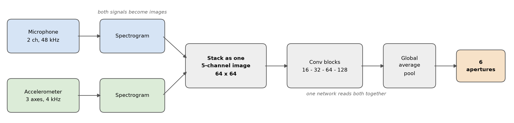

# Cavitation monitoring of a centrifugal pump from sound and vibration

Full report of the work: pipeline, models, experiments and results.

---

## 1. Goal

Predict the state of the pump from a microphone and an accelerometer. An inlet valve is
closed in steps, and the task is to recognise the setting from a short slice of the two
signals:

`nominal · 75% · 50% · 25% · 20% · 15%`

Cavitation is never fully developed for safety reasons and begins around the 25% setting,
so the six settings really cover three physical states: no cavitation (nominal, 75%, 50%),
onset (25%) and developing cavitation (20%, 15%).

---

## 2. Data

| | |
|---|---|
| Recordings | 43 usable (23 clean, 20 noisy) |
| Length | mostly 180 s, some 100–300 s |
| Microphone | 2 channels, 48 kHz |
| Accelerometer | 3 axes, 4 kHz |
| Labels | one valve setting per recording |

Clean and noisy (second pump running) are treated as two separate datasets, as instructed.
One recording (`20260401_133648`) was dropped because its accelerometer file is empty. The
IMU and piezo files are empty throughout and were not used.

Recordings per class:

| | nominal | 75% | 50% | 25% | 20% | 15% |
|---|:---:|:---:|:---:|:---:|:---:|:---:|
| Clean | 6 | 4 | 4 | 5 | 2 | 2 |
| Noisy | 3 | 4 | 5 | 4 | 2 | 2 |

The two most severe settings have only two recordings each per condition, which turns out
to be the main limit on performance.

---

## 3. Pipeline

**Step 1 — Preparation (`preprocess.py`).** The raw CSV files are read once and each
recording is stored compactly (accelerometer as float32, microphone as int16), together
with an index listing every recording and its label. This is done once and never repeated.

**Step 2 — Windows (`dataset.py`).** Each recording is cut into 1-second windows. Training
uses 50% overlap; testing uses none. Per window and per channel the mean is removed (this
takes out gravity on the accelerometer) while the amplitude is kept, because vibration
level itself carries information. Microphone samples are scaled to roughly ±1.

**Step 3 — Model (`model.py`).** Described in section 5.

**Step 4 — Evaluation (`cross_validate.py`, `shuffled_window.py`).** Described in
section 4.

Training settings, identical for every model so comparisons are fair: AdamW, learning rate
1e-3, weight decay 1e-4, cosine schedule, batch size 32, 20 epochs, class weighting to
compensate the uneven number of recordings, and a fixed random seed so every run reproduces
exactly.

---

## 4. How the models were evaluated

Two protocols were used, and the difference between them turned out to be larger than the
difference between any two models.

**Shuffled windows.** All windows from all recordings are pooled, shuffled, and split
70/15/15. This is the protocol in the reference MATLAB implementation (`randperm` over all
observations). Because windows from the same recording appear in both training and test,
and neighbouring windows of a steady recording are nearly identical, the model is tested on
data very similar to what it trained on.

**New recordings.** A whole recording is held out, the model trains on the remaining ones,
and this repeats until every recording has been the test recording once. Training and test
never share a recording. Since each recording is a single operating point, this measures
whether the model recognises a recording it has never seen.

For the larger pooled experiments, 4 folds of several recordings were used instead of one
at a time. Whole recordings still stay together, so there is no overlap; it simply trains 4
models instead of 43.

Each recording's answer is the average of its window predictions. Results are reported
three ways: the exact 6 settings, the three physical levels, and cavitation versus no
cavitation.

---

## 5. Models tried

**Sound only / vibration only.** Single-branch 1-D CNN on the raw signal. Used as
baselines.

**Fusion (intermediate).** Two parallel 1-D CNN branches, one per sensor, each reduced to a
feature vector by global average pooling, then concatenated and classified. This mirrors the
structure of the reference implementation and works directly on the time-domain signal.

**Gated fusion.** As above, but a small gate reads both feature vectors and weights each
modality, so an unreliable sensor can be turned down instead of dragging the result along.

**Spectral fusion.** Each signal is converted to a spectrogram and processed by a 2-D CNN
branch, then fused. Motivated by cavitation being an impulsive, broadband phenomenon that is
clearer in the frequency domain.

**Hybrid.** Raw signal branch, spectrogram branch, and a small set of hand-crafted
descriptors (RMS, kurtosis, crest factor, spectral centroid, high-frequency ratio), all
combined.

**Early fusion (final model).** Both signals are turned into spectrograms, resized to a
common 64×64 grid, and stacked as the channels of a single image (2 microphone + 3
accelerometer = 5 channels). One CNN reads that image, so the two sensors are combined at
the input rather than in separate branches. Four convolution blocks (16, 32, 64, 128
filters, 3×3 kernels, max pooling), global average pooling, then a small classifier.
About 115k parameters, less than half the size of the hybrid model.

*Both signals become spectrograms, are stacked into one image, and are read by a single
network.*

---

## 6. Results

### 6.1 Final model, new-recording test

Early fusion, clean and noisy kept separate:

| Condition | 6 apertures | 3 levels | Cavitation vs. none |
|-----------|:---:|:---:|:---:|
| Clean | 0.70 (16/23) | 0.96 (22/23) | **1.00 (23/23)** |
| Noisy | 0.80 (16/20) | 0.95 (19/20) | **1.00 (20/20)** |

Cavitation is separated from no cavitation without a single mistake in either condition.

### 6.2 All models on the same footing

Pooled recordings, 4 folds, identical training settings:

| Model | Input | 6 apertures | 3 levels | Cavitation |
|-------|-------|:---:|:---:|:---:|
| **Early fusion** | spectrograms | **0.84 (36/43)** | **1.00** | 1.00 |
| Aperture as a number | spectrograms | 0.79 (34/43) | 0.98 | 1.00 |
| Fusion (intermediate) | raw time domain | 0.74 (32/43) | 0.98 | 1.00 |

Earlier runs, before the seed was fixed and under other protocols, are consistent with this
ordering: sound only 0.65, hybrid 0.74, spectral 0.61, gated fusion 0.70.

### 6.3 Is the time-frequency transform worth it?

Relevant for running on a low-end device, where a spectrogram is expensive:

| | 6 apertures | Cavitation vs. none |
|---|:---:|:---:|
| Raw time domain (no transform) | 0.74 | **1.00** |
| Spectrograms | **0.84** | **1.00** |

The transform is worth about 9 points on the exact six settings, but **nothing at all for
detecting cavitation**, where both reach 100%. So if the goal on the device is to answer
"is the pump cavitating", the cheap time-domain model is enough and no transform is needed.
The transform only pays off if the exact aperture is required.

### 6.4 Shuffled windows, for comparison

Clean data, same models:

| Model | Accuracy |
|-------|:---:|
| Fusion | 0.997 |
| Sound only | 0.999 |
| Hybrid | 1.000 |
| Early fusion | 1.000 |

Every model reaches essentially 100%. The same early-fusion model scores 1.00 here and 0.70
with held-out recordings, which shows the protocol matters more than the architecture.

### 6.5 Predicting the aperture as a number

Instead of six classes the model predicts the opening directly (nominal counted as 100%):

| | As 6 classes | As a number |
|---|:---:|:---:|
| 6 apertures | **0.84** | 0.79 |
| Average error | — | **3.8 aperture points** |
| Cavitation | 1.00 | 1.00 (no window wrong) |

33 of 43 recordings land within 5 points of the true opening. This version handles the 20%
setting perfectly (4/4 against 3/4), but underestimates the fully open recordings, which it
predicts around 82–88 instead of 100, so they snap down to 75. Predictions are pulled
towards the middle of the range, which costs accuracy at the ends. The two views are
complementary, and the average error is the more informative number.

### 6.6 Keeping clean and noisy separate

| | Separate | Pooled |
|---|:---:|:---:|
| 6 apertures | 0.74 (32/43) | **0.84 (36/43)** |
| 3 levels | 0.95 | **1.00** |
| Cavitation | 1.00 | 1.00 |

Pooling helps mainly the two settings with few recordings: 20% and 15% improve from 3/8 to
5/8, because each then has 4 recordings instead of 2. Part of the gain is simply more
training data, since the pooled run trains on about 32 recordings per fold against 22 and 19
for the separate ones.

---

## 7. Things that were tried and did not help

| Idea | Result |
|------|--------|
| Augmentation (time shift, volume, noise) | No improvement. It varies the recordings already available and cannot add new operating points. |
| Larger spectrograms (128×128) | 0.70 against 0.70 for 64×64. No gain, twice the compute. |
| Soft voting instead of majority | Identical result on every run. |
| AdamW and cosine schedule | No change to the 6-aperture result, kept as reasonable regularisation. |
| Gated fusion | No better than plain fusion. The gate cannot learn to distrust a sensor, because on the training data both look reliable. |
| Hand-crafted descriptors (hybrid) | 0.74, below early fusion. |

Together these show the limit is the amount of data, not the training recipe: five different
changes to the model or optimisation left the result unchanged, while adding recordings
(pooling) moved it by 10 points.

---

## 8. Where the errors are

Every mistake is between neighbouring settings:

- **nominal and 75%** — neither has cavitation and they differ only in flow rate.
- **20% and 15%** — both in the developing region, and each has only 2 recordings.

No recording with cavitation was ever labelled as no cavitation, in any condition or any
model. The mistakes are therefore always "one step off", never a missed detection.

---

## 9. Limitations

- **20% and 15% have 2 recordings each per condition.** Holding one out leaves a single
  example to learn from, and the two are recorded at different microphone distances, so the
  model must generalise across distance from one example. Their individual results are not
  reliable; they are reliable when reported together as one level.
- **nominal and 75% are physically very close.** With no cavitation at either setting, the
  difference is flow rate only, so some confusion is expected regardless of the model.
- **One session, one pump.** All recordings come from a single day, so the results say
  nothing about a different pump or a different installation.
- **The exact numbers are strict.** They come from testing on recordings never seen during
  training. The same models reach 100% when windows are shuffled instead.

---

## 10. Conclusions

1. **Cavitation detection is solved on this data.** Every model, including the cheap
   time-domain one, separates cavitation from no cavitation perfectly on unseen recordings,
   in both clean and noisy conditions.
2. **Early fusion is the best of the models tried** for the exact aperture: 0.84 pooled,
   with less than half the parameters of the hybrid.
3. **The evaluation protocol dominates the result.** The same model scores 1.00 with
   shuffled windows and 0.70–0.84 with held-out recordings.
4. **The remaining errors are physical or data-related**, not modelling failures: adjacent
   settings and the two classes with two recordings.
5. **For a low-end device**, the time-frequency transform is not needed if the goal is
   cavitation detection; it only helps for the exact aperture.

## 11. Possible next steps

- More recordings of 20% and 15%, which is the only change likely to lift the exact-aperture
  result.
- Reporting the aperture as a continuous value, which suits the settings that sit close
  together and gives an error of about 4 points.
- Running the time-domain model on the device, since it needs no transform and detects
  cavitation just as well.
- Two-stage classification (first the level, then the setting within it) and self-supervised
  pretraining, if more data becomes available.
