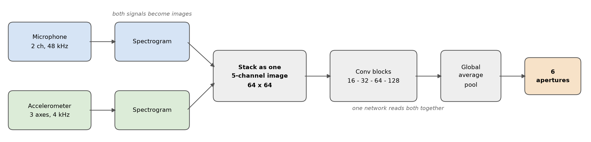

# Cavitation monitoring of a centrifugal pump from sound and vibration

Sina Mohebbi

---

## 1. Goal

Predict the state of the pump from a microphone and an accelerometer. An inlet valve is
closed in steps, and the task is to recognise the setting from a short slice of the two
signals:

`nominal · 75% · 50% · 25% · 20% · 15%`

Cavitation is never fully developed for safety reasons and begins around the 25% setting,
so the six settings really cover three physical states: no cavitation (nominal, 75%, 50%),
onset (25%) and developing cavitation (20%, 15%).

---

## 2. Data

| | |
|---|---|
| Recordings | 43 usable (23 clean, 20 noisy) |
| Length | mostly 180 s, some 100–300 s |
| Microphone | 2 channels, 48 kHz |
| Accelerometer | 3 axes, 4 kHz |
| Labels | one valve setting per recording |

Clean and noisy (second pump running) are treated as two separate datasets, as instructed.
One recording (`20260401_133648`) was dropped because its accelerometer file is empty. The
IMU and piezo files are empty throughout and were not used.

Recordings per class:

| | nominal | 75% | 50% | 25% | 20% | 15% |
|---|:---:|:---:|:---:|:---:|:---:|:---:|
| Clean | 6 | 4 | 4 | 5 | 2 | 2 |
| Noisy | 3 | 4 | 5 | 4 | 2 | 2 |

The two most severe settings have only two recordings each per condition, which turns out
to be the main limit on performance.

---

## 3. Pipeline

**Step 1 — Preparation (`preprocess.py`).** The raw CSV files are read once and each
recording is stored compactly (accelerometer as float32, microphone as int16), together
with an index listing every recording and its label. This is done once and never repeated.

**Step 2 — Windows and normalisation (`dataset.py`).** Each recording is cut into 1-second
windows (50% overlap in training, none in testing). Both sensors are used in full: all three
accelerometer axes (x, y, z) and both microphone channels. Normalisation is applied per
window and per channel: the mean is subtracted, which removes the DC component and the
gravity offset on the accelerometer; the microphone is then divided by 32768 to bring it to
roughly ±1, and the accelerometer is kept in g. Amplitude is deliberately preserved (no
unit-variance scaling), because the vibration and sound level themselves change with the
operating point and carry information.

**Step 3 — Data augmentation (training only).** To reduce overfitting on the small set of
recordings, each training window is perturbed on the fly: a random time shift of up to ±10%
of the window length, a random gain of ±8%, and additive Gaussian noise at 2% of the
window's standard deviation. The same shift and gain are applied to both signals so they
stay aligned in time. Test windows are never augmented.

**Step 4 — Time-frequency transform (for the spectrogram models).** The transform used is a
short-time Fourier transform (STFT), not a wavelet transform. The magnitude spectrogram is
taken and passed through log(1 + x). Window and hop are 1024 / 512 for the microphone
(48 kHz) and 256 / 128 for the accelerometer (4 kHz); a Hann window is used. For the early
fusion model each spectrogram is then resized to a common 64×64 grid so the two sensors can
be stacked. The time-domain models skip this step entirely.

**Step 5 — Model (`model.py`).** Described in section 5.

**Step 6 — Evaluation (`cross_validate.py`, `shuffled_window.py`).** Described in section 4.

Training settings, identical for every model so comparisons are fair: AdamW, learning rate
1e-3, weight decay 1e-4, cosine schedule, batch size 32, 20 epochs, class weighting to
compensate the uneven number of recordings, and a fixed random seed so every run reproduces
exactly.

---

## 4. How the models were evaluated

Two protocols were used, and the difference between them turned out to be larger than the
difference between any two models.

**Shuffled windows.** All windows from all recordings are pooled, shuffled, and split
70/15/15. This is the protocol in the reference MATLAB implementation (`randperm` over all
observations). Because windows from the same recording appear in both training and test,
and neighbouring windows of a steady recording are nearly identical, the model is tested on
data very similar to what it trained on.

**New recordings.** A whole recording is held out, the model trains on the remaining ones,
and this repeats until every recording has been the test recording once. Training and test
never share a recording. Since each recording is a single operating point, this measures
whether the model recognises a recording it has never seen.

For the larger pooled experiments, 4 folds of several recordings were used instead of one
at a time. Whole recordings still stay together across folds; it simply trains 4 models
instead of 43.

**A note on window overlap.** Training windows overlap by 50% while test windows do not.
This means the correlation between neighbouring windows is higher in training than in test.
The choice is deliberate: overlap gives the training set more examples, while
non-overlapping test windows are more independent and make the test stricter, not easier.
More importantly, whole recordings are held out, so no window in the test set shares a
recording with any training window regardless of overlap. A version with matched overlap can
be run if a like-for-like correlation structure is preferred.

**Metrics.** For classification the reported figure is recording-level accuracy: each
recording's windows are classified, the majority label is taken as the recording's
prediction, and accuracy is the fraction of recordings predicted correctly. The bracketed
numbers give this fraction explicitly, e.g. 0.84 (36/43) means 36 of 43 recordings correct.
Macro-F1 (the unweighted average of the per-class F1 scores) is also reported, and confusion
matrices are given in the run logs. For the regression variant the metrics are mean absolute
error, root mean squared error and R², since the target is a continuous value.

**The three views.** The six settings are also reported after merging them into the three
physical states (none / onset / developing) and into two groups (cavitation vs. no
cavitation). These are not separate models and not one-class detection: the same six-class
predictions are simply grouped, so "cavitation vs. no cavitation" is a two-class summary of
the same output, which shows how many mistakes cross the boundary that actually matters.

---

## 5. Models tried

**Sound only / vibration only.** Single-branch 1-D CNN on the raw signal, used as baselines.
Sound only uses the two microphone channels; vibration only uses the vertical accelerometer
axis (a single channel).

**Fusion (intermediate).** Two parallel 1-D CNN branches, one per sensor (microphone: 2
channels; accelerometer: the vertical axis), each reduced to a feature vector by global
average pooling, then concatenated and classified. This mirrors the structure of the
reference implementation and works directly on the time-domain signal. The spectrogram
models (spectral, hybrid, early fusion) instead use all three accelerometer axes.

**Gated fusion.** As above, but a small gate reads both feature vectors and weights each
modality, so an unreliable sensor can be turned down instead of dragging the result along.

**Spectral fusion.** Each signal is converted to a spectrogram and processed by a 2-D CNN
branch, then fused. Motivated by cavitation being an impulsive, broadband phenomenon that is
clearer in the frequency domain.

**Hybrid.** Raw signal branch, spectrogram branch, and a small set of hand-crafted
descriptors (RMS, kurtosis, crest factor, spectral centroid, high-frequency ratio), all
combined.

**Early fusion (the multimodal model).** Both signals are turned into spectrograms, resized
to a common 64×64 grid, and stacked as the channels of a single image (2 microphone + 3
accelerometer = 5 channels). One CNN reads that image, so the two sensors are combined at
the input rather than in separate branches. Four convolution blocks (16, 32, 64, 128
filters, 3×3 kernels, max pooling), global average pooling, then a small classifier.
About 115k parameters, less than half the size of the hybrid model. This was the strongest of
the fusion approaches, though — as the results show — a single accelerometer does as well.

*Both signals become spectrograms, are stacked into one image, and are read by a single
network.*

---

## 6. Results

### 6.1 The recommended model on the separated setup

A single accelerometer (vibration only), clean and noisy kept separate. Accuracy and macro-F1
are for the 6-aperture task; the last two columns group the same predictions into 3 levels
and into cavitation vs. none:

| Condition | Accuracy | Macro-F1 | 3 levels | Cavitation vs. none |
|-----------|:---:|:---:|:---:|:---:|
| Clean | 0.74 (17/23) | 0.63 | 0.96 (22/23) | **1.00 (23/23)** |
| Noisy | 0.80 (16/20) | 0.70 | 0.95 (19/20) | **1.00 (20/20)** |

For comparison, the multimodal early-fusion model on the same setup gives 0.70 (clean) and
0.80 (noisy), so on the separated data too a single accelerometer is as good or better.
Cavitation is separated from no cavitation without a single mistake in either condition.

### 6.2 All models on the same footing

Pooled recordings, 4 folds, identical training settings. Accuracy and macro-F1 are for the
6 apertures; the last column is accuracy for cavitation vs. none:

| Model | Sensors | Input | Accuracy | Macro-F1 | Cavitation |
|-------|---------|-------|:---:|:---:|:---:|
| **Vibration only** | accel (1 axis) | raw time domain | **0.86 (37/43)** | **0.82** | 1.00 |
| Early fusion | mic + accel (3 axes) | spectrograms | 0.84 (36/43) | 0.80 | 1.00 |
| Aperture as a number | mic + accel (3 axes) | spectrograms | 0.79 (34/43) | 0.78 | 1.00 |
| Sound only | mic (2 ch) | raw time domain | 0.77 (33/43) | 0.69 | 1.00 |
| Fusion (intermediate) | mic + accel (1 axis) | raw time domain | 0.74 (32/43) | 0.67 | 1.00 |

The clearest result is that **vibration is the more informative sensor**: the accelerometer
alone (0.86) does markedly better than the microphone alone (0.77). Combining the two does
not improve on it — early fusion (0.84) matches vibration-only within one recording, and the
intermediate fusion of the raw signals (0.74) is actually worse than either sensor on its
own, because the weaker branch drags the stronger one down. So on this data a **single
accelerometer, with no transform, is both the best and the cheapest option**; adding sound
does not help.

Cavitation itself is detected perfectly by every model in the table, including each single
sensor on its own.

### 6.3 Is the time-frequency transform worth it?

Relevant for a low-end device, where the time-frequency transform (the short-time Fourier
transform of Section 3, not a wavelet) is expensive. Comparing the best model of each type:

| | Best model | Accuracy | Cavitation vs. none |
|---|---|:---:|:---:|
| Raw time domain (no transform) | vibration only | **0.86** | 1.00 |
| Spectrograms | early fusion | 0.84 | 1.00 |

The transform does **not** help here. The best time-domain model — a single accelerometer read
directly — reaches 0.86, as good as the best spectrogram model (0.84), and detects cavitation
just as perfectly. (Within the spectrogram models the transform did help, lifting the raw
fusion from 0.74 to 0.84, but that whole path is unnecessary once vibration alone is used.)
So for this task the cheapest possible setup — one accelerometer, no transform — is also the
best, both for cavitation detection and for the exact aperture.

### 6.4 Shuffled windows, for comparison

Clean data, same models:

| Model | Accuracy |
|-------|:---:|
| Fusion | 0.997 |
| Sound only | 0.999 |
| Hybrid | 1.000 |
| Early fusion | 1.000 |

Every model reaches essentially 100%. The same early-fusion model scores 1.00 here and 0.70
with held-out recordings, which shows the protocol matters more than the architecture.

### 6.5 Predicting the aperture as a number

This uses the **same early fusion model and the same input** (microphone and all three
accelerometer axes, as spectrograms); only the output is changed from six class scores to a
single continuous value, and the network is trained with a smooth L1 (Huber) loss. The
opening is predicted directly, with nominal counted as 100% open. Evaluated pooled, 4 folds.

Because the target is now a number, the metrics are regression metrics:

| Metric | Value |
|---|:---:|
| Mean absolute error (MAE) | **3.8 aperture points** |
| Root mean squared error (RMSE) | 6.6 aperture points |
| R² | **0.95** |

To compare with the classifier, each prediction is also snapped to the nearest real setting:

| | As 6 classes | As a number (snapped) |
|---|:---:|:---:|
| Accuracy | 0.84 (36/43) | 0.79 (34/43) |
| Macro-F1 | 0.80 | 0.78 |
| Cavitation | 1.00 | 1.00 (no window wrong) |

33 of 43 recordings land within 5 points of the true opening. This version handles the 20%
setting perfectly (4/4 against 3/4), but underestimates the fully open recordings, which it
predicts around 82–88 instead of 100, so they snap down to 75. Predictions are pulled
towards the middle of the range, which costs accuracy at the ends.

### 6.6 Keeping clean and noisy separate

Using the vibration-only model, the two conditions evaluated separately versus all recordings
pooled together:

| | Separate | Pooled |
|---|:---:|:---:|
| 6 apertures | 0.77 (33/43) | **0.86 (37/43)** |
| 3 levels | 0.95 | **0.98** |
| Cavitation | 1.00 | 1.00 |

Pooling helps mainly the two settings with few recordings: 20% and 15% improve from 3/8 to
5/8, because each then has 4 recordings instead of 2. Part of the gain is simply more training
data, since the pooled run trains on about 32 recordings per fold against 17 and 15 for the
separate ones.

---

## 7. Things that were tried and did not help

| Idea | Result |
|------|--------|
| Larger spectrograms (128×128) | 0.70 against 0.70 for 64×64. No gain, twice the compute. |
| Soft voting instead of majority | Identical result on every run. |
| AdamW and cosine schedule | No change to the 6-aperture result, kept as reasonable regularisation. |
| Gated fusion | No better than plain fusion. The gate cannot learn to distrust a sensor, because on the training data both look reliable. |
| Hand-crafted descriptors (hybrid) | 0.74, below early fusion. |

Together these show the limit is the amount of data, not the training recipe: several
different changes to the model or optimisation left the result unchanged, while adding
recordings (pooling) moved it by 10 points.

---

## 8. Where the errors are

Every mistake is between neighbouring settings:

- **nominal and 75%** — neither has cavitation and they differ only in flow rate.
- **20% and 15%** — both in the developing region, and each has only 2 recordings.

No recording with cavitation was ever labelled as no cavitation, in any condition or any
model. The mistakes are therefore always "one step off", never a missed detection.

---

## 9. Limitations

- **20% and 15% have 2 recordings each per condition.** Holding one out leaves a single
  example to learn from, and the two are recorded at different microphone distances, so the
  model must generalise across distance from one example. Their individual results are not
  reliable; they are reliable when reported together as one level.
- **nominal and 75% are physically very close.** With no cavitation at either setting, the
  difference is flow rate only, so some confusion is expected regardless of the model.
- **One session, one pump.** All recordings come from a single day, so the results say
  nothing about a different pump or a different installation.
- **The exact numbers are strict.** They come from testing on recordings never seen during
  training. The same models reach 100% when windows are shuffled instead.

---

## 10. Conclusions

1. **Cavitation detection is reliable on this data.** Every model, including a single
   accelerometer read directly, separates cavitation from no cavitation perfectly on unseen
   recordings, in both clean and noisy conditions.
2. **Vibration is the more informative sensor.** The accelerometer alone reaches 0.86 on the
   exact aperture, well above the microphone alone (0.77).
3. **Combining the two sensors does not help.** Early fusion (0.84) matches vibration-only
   within one recording but does not beat it, and the intermediate fusion of the raw signals
   (0.74) is worse than either sensor on its own.
4. **The time-frequency transform is not needed.** A single accelerometer in the time domain
   is both the best model and the cheapest, so the transform can be skipped.
5. **The evaluation protocol dominates the result.** The same model scores 1.00 with shuffled
   windows and 0.70–0.86 with held-out recordings.
6. **The remaining errors are physical or data-related**, not modelling failures: adjacent
   settings and the two classes with two recordings.

## 11. Possible next steps

- More recordings of 20% and 15%, which is the only change likely to lift the exact-aperture
  result.
- Reporting the aperture as a continuous value, which suits the settings that sit close
  together and gives an error of about 4 points.
- Deploying a single accelerometer read in the time domain, since it is the best model here
  and needs no transform, which suits a low-end device.
- Two-stage classification (first the level, then the setting within it) and self-supervised
  pretraining, if more data becomes available.
